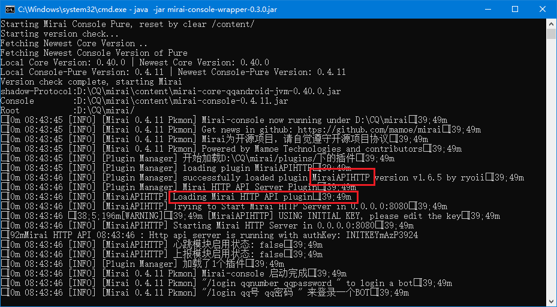
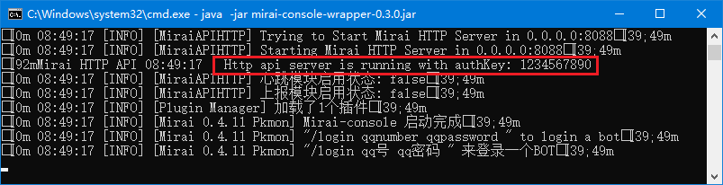

# CQMirai
一个在酷Q和mirai之间 ~~蹦迪~~ 转换http消息的桥  
~~取名：酷Q的未来~~

采用AGPL协议  

项目起源于[HoshinoBot](https://github.com/Ice-Cirno/HoshinoBot)适配Mirai  
所以目前仅会适配采用类似协议的bot

## 使用依赖
[Mirai](https://github.com/mamoe/mirai) 全开源 高效率 QQ机器人/Android QQ协议支持库  
[Mirai-Console](https://github.com/mamoe/mirai-console) 高效率插件支持机器人框架 [Release](https://github.com/mamoe/mirai-console/releases/tag/wrapper-0.3.0)  
[Mirai-API-HTTP](https://github.com/mamoe/mirai-api-http/releases) Mirai-API-http插件 提供HTTP API供所有语言使用mirai [Release](https://github.com/mamoe/mirai-api-http/releases/latest)

## 使用方式
首先请确保安装了[Java](java.com)和[golang](https://golang.google.cn/)，前者是mirai的运行时，后者用来编译本项目
### Mirai部分 已有可运行的mirai可跳过  
下载
[mirai-console-wrapper-0.3.0.jar](https://github.com/mamoe/mirai-console/releases/download/wrapper-0.3.0/mirai-console-wrapper-0.3.0.jar)
，放入文件夹中，使用命令行运行此jar`java -jar mirai-console-wrapper-0.3.0.jar`，此处一般选择Pure版本即输入`Pure`后回车  
出现`"/login qq号 qq密码 " 来登录一个BOT`字样即完成。

### mirai-api-http部分 确认已有可运行的http插件可跳过
`Ctrl+C` 结束刚刚启动的mirai，下载
[mirai-api-http-v1.6.5.jar](https://github.com/mamoe/mirai-api-http/releases/download/v1.6.5/mirai-api-http-v1.6.5.jar)
放入文件夹下`plugins`文件夹，返回刚才目录再次运行`java -jar mirai-console-wrapper-0.3.0.jar`，出现`successfully loaded plugin MiraiAPIHTTP version v1.6.5 by ryoii`字样即成功安装插件
  
之后在`plugins/MiraiAPIHTTP`文件夹下编辑生成的`setting.yml`，填入相应信息
```yaml
## 该配置为全局配置，对所有Session有效

# 可选，默认值为8080
port: 8088          

# 可选，默认由插件随机生成，建议手动指定
authKey: 1234567890  

# 可选，缓存大小，默认4096.缓存过小会导致引用回复与撤回消息失败
cacheSize: 4096

# 可选，是否开启websocket，默认关闭，建议通过Session范围的配置设置
enableWebsocket: true

# 可选，配置CORS跨域，默认为*，即允许所有域名
cors: 
  - '*'
```
随后再次重启jar，出现`Http api server is running with authKey: 1234567890`即完成安装
  
此时已可用`/login xxxxxx yyyyyyy`进行登录

### CQMirai部分

#### 请先确定CQBot在运行中并将模式设置为WS反向即`WSR`模式，并确认连接信息

下载源码，可通过上方`Download ZIP`或`git clone --depth 1 http://gitee.com/LXY1226/cqmirai`进行下载  
修改config.sample.go，将信息准确填入后运行`GOPROXY=http://goproxy.cn go run .`或`set GOPROXY=http://goproxy.cn && go run .`

#### 如果上方这一堆东西不能理解的话
这里有一个Win下使用的[压缩档](https://cloud.189.cn/t/2E7vIz7RVryq)，也许能帮到你。

## 目前已经实现的[接口](msgutil.go)：


|酷QHTTP|描述|备注|
|-------------|---|---|
|send_msg|发送消息|暂只支持群/好友，部分CQ码可用|
|get_group_member_info|获取群员信息|在cqmirai中缓存的信息，目前mirai-http未实现该接口|
|set_group_ban|禁言|正常工作|
|get_group_member_list|获取群员列表|正常工作|
|get_group_list|获取群列表|正常工作|
|get_group_member_list|获取群员列表|正常工作|

|mirai-http|描述|备注|
|-------------|---|---|
|GroupMessage|接收群消息|部分可转化为CQ码|
|FriendMessage|接收好友消息|部分可转化为CQ码，未测试|

感谢mirai背后的momoe团队做出得贡献  
以及mirai群大佬们对我的打磨  

